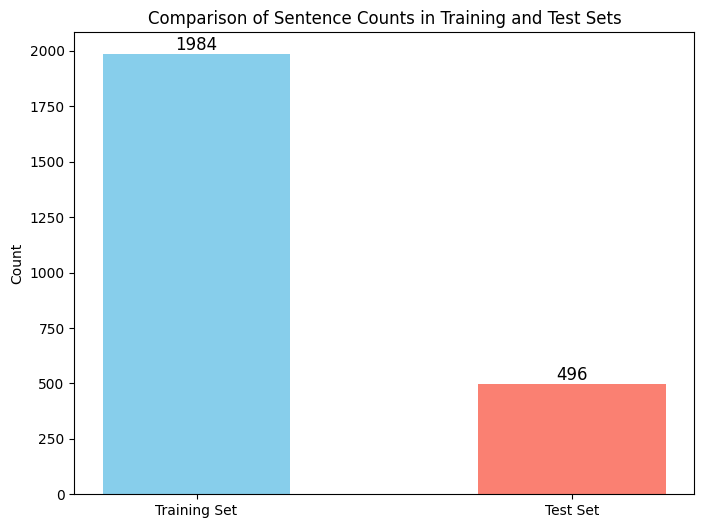
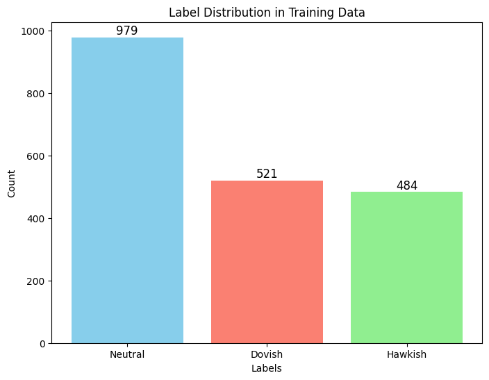
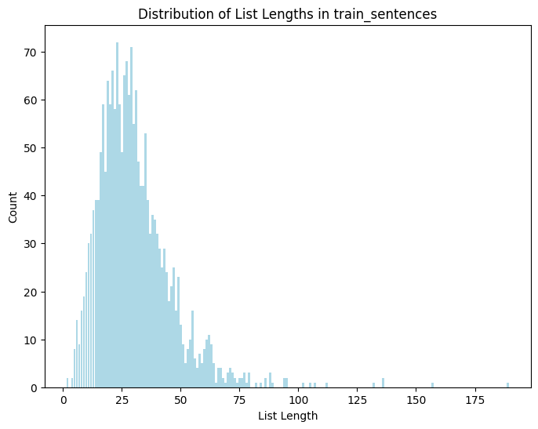
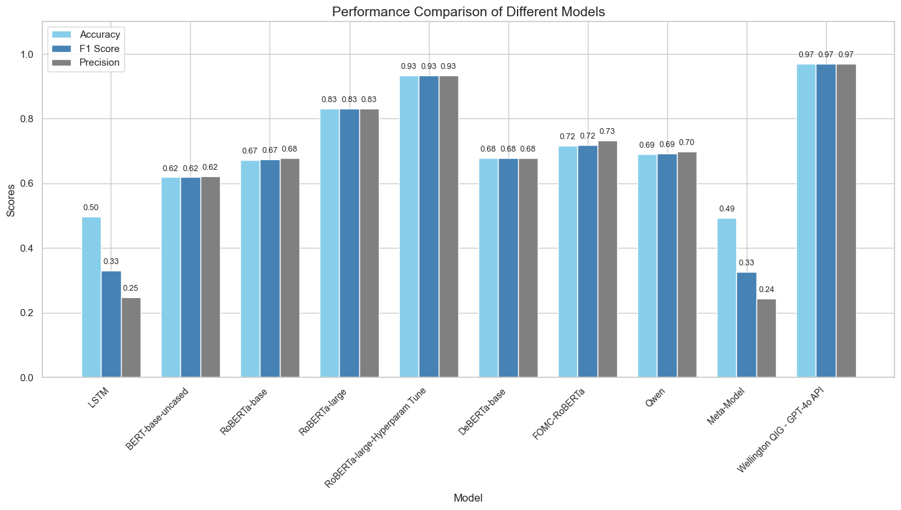
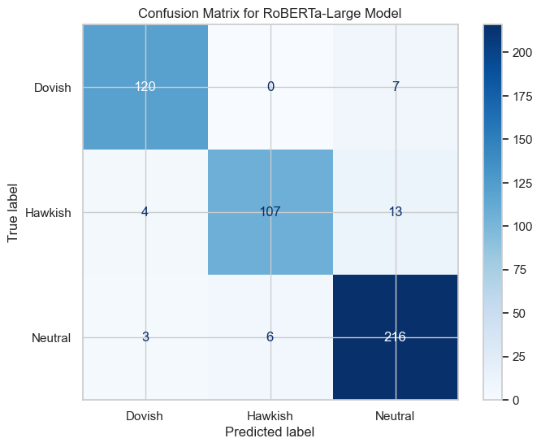
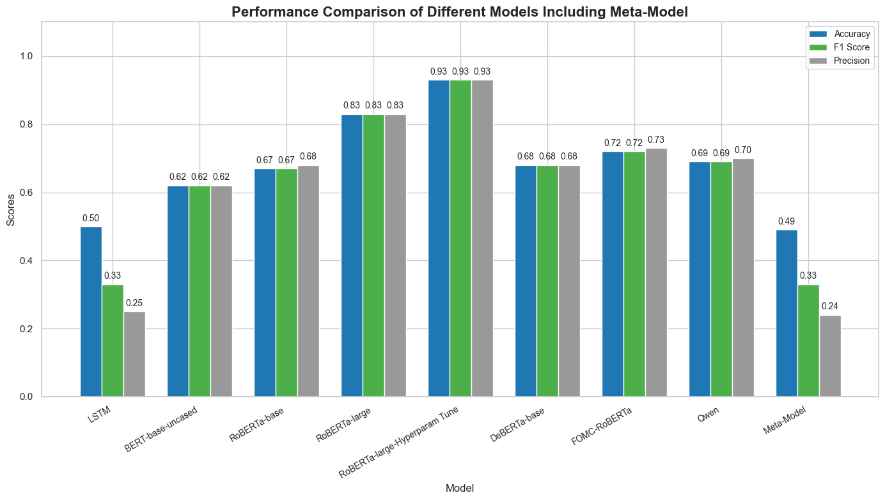
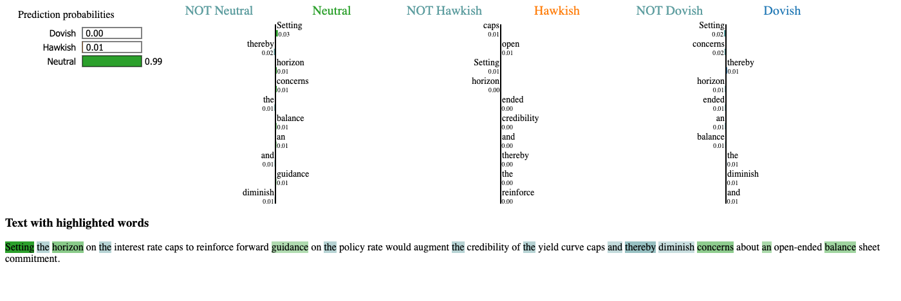
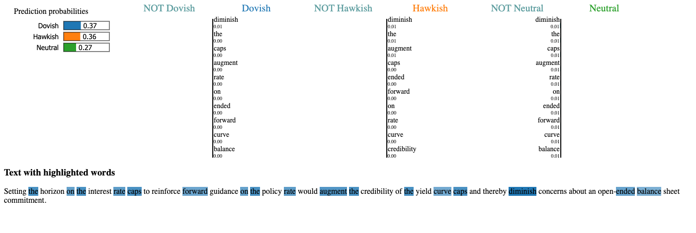

<h1 align="center">FOMC Sentiment Analysis</h1>

<p align="center">
  <strong>Neural Networks &amp; Deep Learning: NLP Classification of FOMC Texts for Market Analysis</strong>
</p>

<p align="center">
  
  
  
  
  
</p>

<p align="center">
  Classifying the policy stance of Federal Reserve communication (<i>Hawkish / Neutral / Dovish</i>)<br>
  with LSTM and transformer architectures, LIME interpretability, and ensemble analysis.
</p>

---

## Authors

Ying Bi (z5444398) &nbsp;·&nbsp; Wing Pui (Nigel) Li (z5320405) &nbsp;·&nbsp; Zhenhua Liu (z5433153) &nbsp;·&nbsp; Tong Zhang (z5542524)

## Table of Contents

1. [Abstract](#abstract)
2. [Point of Study](#1-point-of-study)
3. [Motivation](#2-motivation)
4. [Data](#3-data)
5. [Methodology](#4-methodology)
6. [Results](#5-results)
7. [Discussion](#6-discussion)
8. [Conclusion](#7-conclusion)
9. [Repository Contents](#repository-contents)
10. [References](#references)

---

## Abstract

> Central bank communication is a significant driver of global financial markets, yet the nuanced language of Federal Reserve policy statements makes automated interpretation difficult. This project frames Federal Open Market Committee (FOMC) communication as a **three-class sentiment classification problem** (*Hawkish*, *Neutral*, *Dovish*) and benchmarks eight deep learning architectures on it. An LSTM recurrent baseline is compared against a family of pretrained transformer encoders (BERT, RoBERTa, DeBERTa, FOMC-RoBERTa, Qwen2.5-3B) under a two-stage hyperparameter selection process. A fine-tuned **RoBERTa-large** model achieves the best performance, and model behaviour is interrogated with LIME local explanations. A stacked meta-model ensemble is evaluated and found to underperform its best constituent.

### Key Results at a Glance

| 🏆 Best Model | Accuracy | vs LSTM Baseline | vs FinBERT Reference |
|:---|:---:|:---:|:---:|
| **RoBERTa-large (tuned)** | **93.3%** | +43.5 pts (49.8%) | +13 pts (~80%, Araci 2019) |

## 1. Point of Study

Can modern deep learning architectures, specifically pretrained transformer encoders, reliably extract the **policy stance** (Hawkish / Neutral / Dovish) embedded in natural-language FOMC statements, and how do they compare to classical recurrent architectures and to frontier LLM APIs on the same task?

## 2. Motivation

- FOMC statements, meeting transcripts, and officials' speeches have historically moved global bond, equity, and FX markets within minutes of release. Investors and policymakers closely parse them to anticipate monetary policy.
- Existing academic models capture coarse sentiment but struggle with the **nuance and intricacy** of financial policy language, where a single qualifier can invert the perceived stance.
- Finance-domain pretrained models (e.g. FinBERT, Araci 2019, ~80% accuracy) leave clear headroom. Literature on stacked ensembles (Etelis et al. 2023, 90%+) suggests further gains may be available through model combination.

## 3. Data

| Property | Detail |
|:---|:---|
| **Source** | Financial Services Innovation Lab, Georgia Tech |
| **Content** | FOMC meeting transcripts, press conferences, and speeches by Federal Reserve officials, 1996 to 2022 |
| **Labels** | Semantic policy-stance labels: **Neutral (0), Hawkish (1), Dovish (2)** |
| **Class balance** | Roughly 2 : 1 : 1 (Neutral dominant) |
| **Split** | 80% train / 20% test |

Natural-language input rendered traditional rebalancing techniques (e.g. SMOTE/ROSE-style resampling) insufficient. The class imbalance was instead handled through model capacity and tuning rather than data augmentation.

### 3.1 Exploratory Analysis

The dataset comprises 2,480 labelled sentences in an 80/20 train/test split.

| Train / Test Split | Class Distribution | Sentence Length Distribution |
|:---:|:---:|:---:|
|  |  |  |

## 4. Methodology

### 4.1 Preprocessing

Two parallel tracks:

- **LSTM track:** sentence to word-list tokenisation, lowercasing, punctuation removal, for word-level sequential encoding.
- **Transformer track:** encoding via pretrained tokenizer/embeddings for the BERT-family models.

### 4.2 Models

Eight models were trained and evaluated under a common protocol:

| # | Model | Role |
|:---:|:---|:---|
| 1 | LSTM | Recurrent baseline (foundational model) |
| 2 | BERT-base-uncased | Transformer baseline |
| 3 | RoBERTa-base | Pretrained encoder |
| 4 | RoBERTa-large | Pretrained encoder (larger capacity) |
| 5 | **RoBERTa-large (hyperparameter-tuned)** | 🏆 Best performer |
| 6 | DeBERTa-base | Two-stage selection candidate |
| 7 | FOMC-RoBERTa | Finance/domain-adapted variant |
| 8 | Qwen2.5-3B | Frontier open-LLM baseline |

Model selection was literature-driven, following prior work on RNN frameworks and pretrained BERT-family encoders.

### 4.3 Hyperparameter Tuning

An initial random search was followed by a targeted two-stage selection over learning rate, batch size, epochs, maximum sequence length, and hidden dropout, retaining **RoBERTa-large (tuned)** and **DeBERTa** as the strongest candidates.

### 4.4 Interpretability

**LIME** (Local Interpretable Model-agnostic Explanations) was applied to RoBERTa-large and the LSTM to attribute per-word contributions to predicted sentiment classes.

### 4.5 Stacking

Predictions from the best models were fed as features to a higher-level **meta-model**, motivated by Etelis et al. (2023).

## 5. Results

Test-set performance, same dataset and evaluation code for all models:

| Model | Accuracy | F1 | Precision |
|:---|---:|---:|---:|
| LSTM (baseline) | 0.498 | 0.331 | 0.248 |
| BERT-base-uncased | 0.619 | 0.619 | 0.622 |
| RoBERTa-base | 0.671 | 0.674 | 0.679 |
| RoBERTa-large | 0.831 | 0.830 | 0.831 |
| **RoBERTa-large (tuned)** | **0.933** | **0.933** | **0.934** |
| DeBERTa-base | 0.677 | 0.678 | 0.678 |
| FOMC-RoBERTa | 0.716 | 0.719 | 0.733 |
| Qwen2.5-3B | 0.690 | 0.693 | 0.698 |
| Meta-Model (stack) | 0.494 | 0.327 | 0.244 |
| *Reference: Wellington QIG, GPT-4o API* | *0.97* | *0.97* | *0.97* |

<p align="center">
  <br>
  <i>Performance comparison of all models, including the stacked meta-model and the GPT-4o API reference.</i>
</p>

All transformer-based models outperform the LSTM baseline, confirming the efficacy of pretrained self-attention architectures for this sentiment task. The tuned RoBERTa-large (roughly 355M parameters, dynamic masking, larger pretraining corpus) substantially exceeds the FinBERT reference (~80%, Araci 2019). The stacked meta-model **underperformed every constituent model**, even the LSTM.

The confusion matrix of the best model shows where the residual errors concentrate, chiefly Hawkish sentences confused with Neutral:

<p align="center">
  
</p>

## 6. Discussion

- **Why RoBERTa-large wins:** greater pretraining data volume, dynamic masking for robust word representations, and substantially larger model capacity, allowing it to capture deeper context dependencies in policy language.
- **Why the LSTM lags:** lower architectural complexity for this task, sensitivity to tuning, and purely sequential processing that fails to isolate the most decision-relevant tokens.
- **Why stacking failed:** (1) weak base-model diversity, as similar architectures produced correlated errors; (2) insufficient training-set size for the meta-model to learn reliable combination weights.

<p align="center">
  <br>
  <i>Stacked meta-model versus its constituents.</i>
</p>

- **LIME analysis:** for identical input, RoBERTa-large is markedly more confident and correctly attributes sentiment-bearing words, while the LSTM misclassifies (e.g. predicting *Dovish* where the true label is *Neutral*).

| RoBERTa-large<br><i>correctly predicts Neutral, 0.99 confidence</i> | LSTM<br><i>misclassifies as Dovish</i> |
|:---:|:---:|
|  |  |

- **Error structure:** remaining confusion concentrates on *Hawkish*, attributable to the nuanced, hedged phrasing typical of policy statements. *Neutral* success partly reflects its dominant class share and the genuinely measured tone of official publications.

## 7. Conclusion

Fine-tuned transformer encoders, RoBERTa-large in particular, are highly effective for FOMC policy-stance classification, reaching 93.3% accuracy and beating both recurrent baselines and domain-specific finance encoders. Simple stacking of homogeneous strong models is not a reliable path to further gains at this data scale. Future work could investigate heterogeneous ensembles, error-focused data augmentation for the Hawkish class, and cross-decade distribution-shift analysis of Fed communication style.

## Repository Contents

```text
├── project_notebook.ipynb        Full end-to-end pipeline: EDA, preprocessing,
│                                 all 8 models, tuning, LIME, stacking, confusion matrices
├── FOMC_Sentiment_Report.pdf     Written project report
├── FOMC_Sentiment_Presentation_FINAL.pptx / .pdf   Final presentation slides
├── figures/                      All visualisations referenced in this README
├── LIME Diagrams/                Interactive LIME explanations (RoBERTa-large, LSTM)
└── requirements.txt              Python dependencies
```

## References

- Araci, D. (2019). *FinBERT: Financial Sentiment Analysis with Pre-trained Language Models.*
- Etelis et al. (2023). *Stacked ensemble approaches for financial text classification.*
